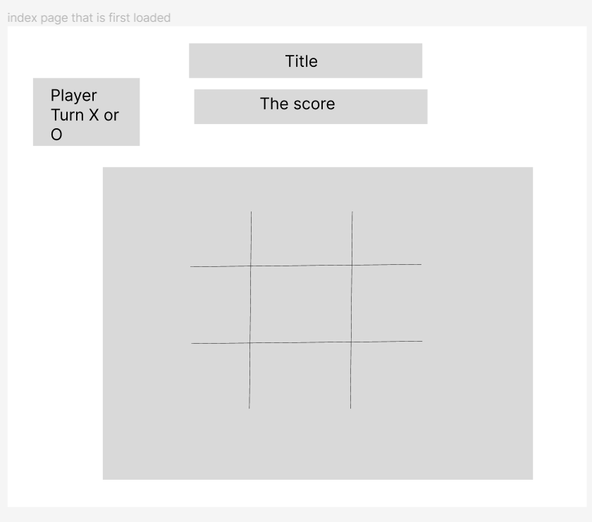

# Project1-Game

Creating a game in Javascript( Tic Tac Toe)

-technologies used
This program developed using HTML, CSS, javascript. JQuery used in the front end to manipulate the elements. Github enterprise used as a repository and a (host).

-Link to wireframes directory

https://www.figma.com/file/7UHgXacQk5IrPLsEq3u4dk/Tic-Tac-Toe?node-id=0%3A1&t=lVI65aMSNVow4UTl-1

-Link to user stories

https://git.generalassemb.ly/jamalalmulla/Project1-Game/tree/main/User%20Stories

-development process and problem-solving strategy

This game has been developed in phases:
1- The planning and analysis phase.
Design phase.
3- Implementation: which itself has 3 phases:
1- creating a prototype for the game.
2- An MVP (A minimum viable product (MVP) is a version of a product with just enough features to be usable by early customers who can then provide feedback for future).
3- Some useful enhancements: - Using LocalStorage to persist data locally. - Involving Audio in the game. - Making the game fully responsive. - styling e.g. using hover effects.

List unsolved problems which would be fixed in future iterations.

I would like to add a feature of playing againist the computer. My perception of it is that it sould include some AI or algorithms that best decide the next play.

solving for the winner

in simple steps as follows:
1- Generate a random turn. Either X or O. If it is not the first round, the last winner will have the turn.
2- iterate over the 9 cells with a click event listener that update the cell mark with the player X or O once clicked.
3- update the gridState array which saves the state of the game.
4- Validate the state and check for wining or draw.

- Describe how some of your favorite functions work
  validateWinner: Its job is to validate if the state forms a winning or draw.
  Various techniques were used to ensure precision that enables this function to achieve her job:
  -sessionStorage to save the state of winner, draw, and score to be retrieved in the coming rounds.
  -Audio elements has been used to equip the game with winning and draw sounds.
  -setTimeout was needed to prevent the alert from preceding updating the cell(as it is faster despite that the jQuery is first in execution order). Another scenario setTimeOut was needed is when the alert preceded the sound effects and prevent them from showing.
  RandomPlayer: uses math.random to generate random turn and uses the great JS feature "Object destructuring" to destruc the needed data.
  Note that: The destructuring assignment syntax is a JavaScript expression that makes it possible to unpack values from arrays, or properties from objects, into distinct variables.
